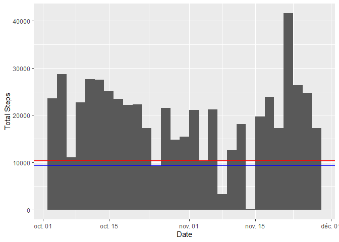
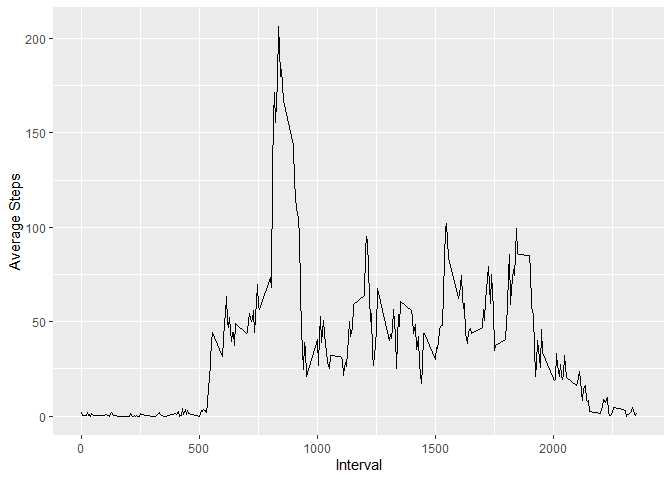
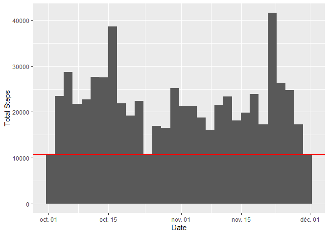
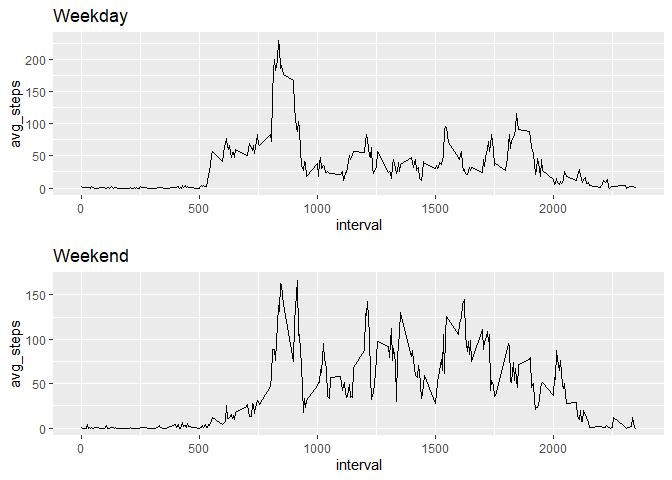

## Loading and preprocessing the data

```r
library(tidyverse)
unzip("activity.zip")
data <- read.csv("activity.csv")
data$date <- as.Date(data$date)
data <- data %>% 
  group_by(date) %>%
  mutate(date_steps_sum = sum(steps, na.rm = TRUE))

data <- data %>%
  group_by(interval) %>%
  mutate(interval_steps_avg = mean(steps, na.rm = TRUE))
```


## What is mean total number of steps taken per day?

```r
total_day_steps <- data[!duplicated(data$date),]

ggplot(total_day_steps %>% uncount(date_steps_sum)) + 
  geom_histogram(aes(x = date)) +
  geom_hline(yintercept = mean(total_day_steps$date_steps_sum), color="blue" ) +
  geom_hline(yintercept = median(total_day_steps$date_steps_sum), color="red" ) +
  xlab("Date") + ylab("Total Steps")
```

<!-- -->

```r
median(total_day_steps$date_steps_sum) %>% print
```

```
## [1] 10395
```

```r
mean(total_day_steps$date_steps_sum) %>% print
```

```
## [1] 9354.23
```


## What is the average daily activity pattern?

```r
total_day_steps <- data[!duplicated(data$interval),]
  
ggplot(total_day_steps, aes(x=interval, y=interval_steps_avg)) +
  geom_line() + xlab("Interval") + ylab("Average Steps")
```

<!-- -->


## Imputing missing values

```r
sum(is.na(data$steps)) %>% print
```

```
## [1] 2304
```

```r
data2 <- data
data2$steps = ifelse(is.na(data2$steps), data2$interval_steps_avg, data2$steps)
data2 <- data2 %>% 
  group_by(date) %>%
  mutate(date_steps_sum = sum(steps, na.rm = TRUE))

total_day_steps <- data2[!duplicated(data2$date),]

ggplot(total_day_steps %>% uncount(date_steps_sum)) + 
  geom_histogram(aes(x = date)) +
  geom_hline(yintercept = mean(total_day_steps$date_steps_sum), color="blue" ) +
  geom_hline(yintercept = median(total_day_steps$date_steps_sum), color="red" ) +
  xlab("Date") + ylab("Total Steps")
```

<!-- -->

```r
median(total_day_steps$date_steps_sum) %>% print
```

```
## [1] 10766.19
```

```r
mean(total_day_steps$date_steps_sum) %>% print
```

```
## [1] 10766.19
```


## Are there differences in activity patterns between weekdays and weekends?

```r
data2 <- data2 %>% 
  mutate(weekend = weekdays(date) %in% c('samedi', 'dimanche'))

grouped_data <- data2 %>% 
  group_by(weekend, interval) %>%
  summarise(avg_steps = mean(steps))

weekday_data <- grouped_data %>% filter(weekend == FALSE)
weekend_data <- grouped_data %>% filter(weekend == TRUE)

p1 <- ggplot(weekday_data, aes(x=interval, y=avg_steps)) +
  geom_line() +
  labs(title = "Weekday", xlab = "AVG-Steps", ylab="Interval")
p2 <- ggplot(weekend_data, aes(x=interval, y=avg_steps)) +
  geom_line() +
  labs(title = "Weekend", xlab = "AVG-Steps", ylab="Interval")

library(gridExtra)
grid.arrange(p1, p2)
```

<!-- -->
